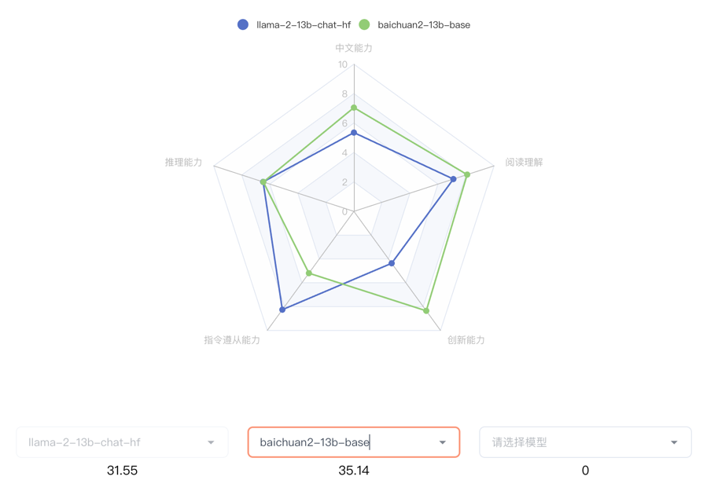

<div align=center></div>


<div align=center><h1><b>构建、训练、部署：LLM-And-More让一切变得更简单</b></h1></div>


<!-- \[ [English](README.md) | 中文 \]-->

## LLM-And-More: 从创意到服务的一站式LLM解决方案

LLM-And-More 是一个专业、开箱即用的大模型训练及应用构建一站式解决方案，包含从数据到评估、从训练到部署、从想法到服务的全流程最佳实践。

项目旨在提供一个专业、开箱即用的大模型训练及应用构建一站式解决方案。您可以轻松地通过本项目进行模型训练，并一键生成所需的产品服务。我们的项目集成了不同应用场景下的专业知识和最佳实践，以保证模型在实际生产中的表现优异。此外，我们集成了高性能模型并行框架，有效地减少了训练和推理时的算力开销，提升了整体的效率。无论您是在构建基于大模型的服务还是在进行私有化模型训练，我们的开源项目将为您提供一个强大且可靠的基础。

如有任何问题，请加入我们的微信群
<div align=center></div>

## 目录

- [功能模块](#功能模块)
- [支持场景](#支持场景)
- [适配模型](#适配模型)
- [安装与使用](deployment.md)

## 功能模块

LLM-And-More致力于为专业开发者和一线业务人员提供同样专业、易用的LLM应用构建方案。为了实现这一理念，LLM-And-More将LLM应用开发过程分解为以下六个模块：

- [数据模块](#数据模块)
- [训练模块](#训练模块)
- [监控模块](#监控模块)
- [评估模块](#评估模块)
- [部署模块](#部署模块)
- [交互模块](#交互模块)

这些模块涵盖了开发一个LLM产品的一切，并注入了专业知识和性能优化组件，全流程协助您构建一个优秀的LLM应用。

### 数据模块

为协助您开始LLM应用构建的第一步，也是影响最终效果的最重要一步：数据标注，LLM-And-More提供了一个功能齐全的数据标注平台。在这里，管理人员可以新建一个数据标注任务，向标注人员分配需要标注的数据，或是亲自对数据进行标注。在完成所有标注之后，LLM-And-More将把标注完成的数据自动转换为模型可以处理的格式(
jsonl)，并存入本地数据库中，在之后的训练、评估模块中一键启用。LLM-And-More还提供了对数据质量的一键检测，用户可以通过查看数据检测报告，发现标注过程中可能产生的错误，提升模型训练的最终效果。


### 训练模块

为协助您完成LLM应用构建最专业，最困难的一步：模型训练，LLM-And-More提供了一个开箱即用的高性能模型训练框架，使您无需了解任何深度学习相关知识，即可轻松对齐大模型训练最佳实践。在训练模块中，用户可以自由调整所选取的基座模型，训练方式，以及batch_size，学习率等超参数。如果用户对此并不了解，LLM-And-More预置的智能默认参数将帮助用户完成参数的选取和调优。LLM-And-More将自动为用户提供DeepSpeed多卡多机加速适配，帮助用户节约训练时间，充分利用算力资源。


### 监控模块

在训练过程中，您可能烦恼于无法清晰直观的观察模型的性能变化，LLM-And-More提供了一个智能化的模型训练监控模块，不仅可以实时、可视化的显示CPU、GPU等核心算力资源的占用情况，监控模型Loss，学习率，训练步数的变化，还可以在训练过程中智能提示您模型的潜在性能风险，并提供恰当的解决方案建议。例如，您在训练过程中可能发现系统提示“过拟合风险”，并建议您“停止训练，降低学习率或增大数据量”，您可以遵循这些建议，尝试解决问题。这节省了不必要的算力浪费，并能使您更精准的把握模型可能的表现。


### 评估模块

在完成训练后，您可能烦恼于无法准确了解模型的性能边界，不敢真正将模型应用于实际场景，LLM-And-More提供了一个客观准确的评估模块，让您可以全面，精准的把握模型的各项能力水准。评估模块分为两个主要评测任务，一个负责评测模型在训练过任务上的性能，主要展现模型是否能够完成用户指定的任务，例如一个客服模型是否能够正确回复用户提问；另一个负责评测模型在五个通用维度上的能力（推理能力，阅读理解能力，中文能力，指令遵从能力，创新能力），主要体现模型是否产生了灾难性遗忘，是否过于专注于特定领域而丧失了通用能力。用户可以根据两方面的反馈，调整模型的训练数据和轮次，选择表现最佳的模型应用于线上系统。



### 部署模块(Coming Soon)

### 交互模块(Coming Soon)

## 支持场景

除了简单的提供输入输出训练您的LLM应用外，我们还提供了丰富的场景支持，帮助您更好的解决您在工作生产当中遇到的复杂问题。例如，您可以基于FAQ场景适配方案，直接构建一个客服，协助您识别用户意图，解决您淘宝店铺自动回复的问题；或是基于RAG场景方案，构建一套企业内部规章制度问答机器人。所有场景均具备独立的留个功能模块，但拥有深度定制的UI和专业Know-How。LLM-And-More支持以下场景：

- [通用场景](#通用场景)
- [FAQ场景](#FAQ场景)
- [RAG场景](#RAG场景)
- [创意写作场景](#创意写作场景)
- [Agent场景](#Agent场景)

### 通用场景

可以接受任意的输入输出，是最基础的训练场景。在该场景中，我们没有针对数据特征、应用范围等进行任何假设，在数据、训练、监控、评估、部署、交互模块中的各项参数均调整至最均衡的水平，并适配了任何场景均有收益的专业Know-How辅助模型训练。总的来说，如果您不确定您应该使用哪个场景，或认为LLM-And-More提供的任何场景均不符合您的要求，您可以选用该场景开始您的构建。

### FAQ场景

该场景适用于FAQ客服或FAQ问答机器人。FAQ(frequently asked questions)
即常见问题，通常应用于客服、快速助手、和在线论坛等场景，在这些地方，常见问题往往会反复出现，例如，用户经常以各种不同的表达方式询问发货时间。在FAQ场景中，用户的问题往往被归类，并对于每一类问题有一个统一的回答，例如针对询问发货时间的问题，统一回复“我们将尽快安排发货，请及时查看物流信息”。直接尝试使用大模型生成这些回答往往是事倍功半的，因为没有充分利用数据的特征，很难让大模型回复稳定，并常常会产生幻觉现象。为此，我们为FAQ场景设计了涵盖全部六个模块的全流程解决方案，主要引入用户意图识别，让LLM预测用户意图（在上述例子中，“查询物流信息”），而不是直接预测回复（在上述例子中，“我们将尽快安排发货，请及时查看物流信息”）。我们在大量FAQ场景中的实验表明，该解决方案可以提升30%以上的回复准确率，并显著降低模型过拟合风险与幻觉现象。

### RAG场景(Coming Soon)

### 创意写作场景(Coming Soon)

### Agent场景(Coming Soon)

## 适配模型

为了支持更广泛的应用，LLM-And-More支持多种多样的模型，并支持您选择多种不同的训练方式。

| 模型名                                                  | 模型大小                    | 支持的训练方法    |
|------------------------------------------------------|-------------------------|------------|
| [Baichuan2](https://huggingface.co/baichuan-inc)     | 7B/13B                  | 全参数训练/Lora |
| [ChatGLM3](https://huggingface.co/THUDM/chatglm3-6b) | 6B                      | 全参数训练/Lora |
| [LLaMA](https://github.com/facebookresearch/llama)   | 7B/13B/33B/65B          | 全参数训练/Lora |
| [LLaMA-2](https://huggingface.co/meta-llama)         | 7B/13B/70B              | 全参数训练/Lora |
| [Qwen](https://huggingface.co/Qwen)                  | 0.5B/1.8B/4B/7B/14B/72B | 全参数训练/Lora |

### 系统架构设计

系统是前后端分离的架构。

#### 模型推理框架

我们使用的是[FastChat](https://github.com/lm-sys/FastChat)作为模型推理框架，FastChat是一个非常优秀的开源项目。

> [FastChat](https://github.com/lm-sys/FastChat) 是一个开放平台，用于训练、服务和评估基于大型语言模型的聊天机器人。

**FastChat我们主要用其三个服务**

`controller` 用于模型的注册中心及健康检查

`worker` 服务启动模型并将当前模型注册到controller

`api` 从controller获取模型的地址代理到worker并提供标准API

我们主要通过它来实现大模型的高可用，高可扩展性。


模型部署的操作可以参考[模型部署](docs/model/list.md)

### 模型微调

为了实现模型的微调，您可以参考我们的详细指南：[模型微调](docs/model/finetune.md)。

### 模型部署与微调

您可以将模型部署到任意配备GPU的节点上，无论是私有的K8s集群、Docker集群，还是云服务商提供的K8s集群，均能轻松对接。

### 本系统组成

本系统主要由以下几个部分组成：

- **HTTP服务**：提供Web服务接口，方便用户进行交互。
- **定时任务**：执行预定任务，如模型训练、数据预处理等。
- **训练镜像**：包含所有必要的环境和依赖，用于模型的训练和微调。

- 通过这些组件的协同工作，我们能够提供一个灵活、高效的模型微调和部署解决方案。

#### 部署流程

```mermaid
graph LR
    A[aigc] --> B[点击部署]
    B --> C[创建部署模版]
    C --> D[使用Docker或k8s进行调度]
    D --> E[挂载相应配置有模型]
    E --> F[启动模型]
    F --> G[注册到fschat-controller]
```

#### 微调训练流程

```mermaid
graph LR
    A[aigc] --> B[上传微调文件]
    B --> C[生成微调模版]
    C --> D[使用Docker或k8s进行调度]
    D --> E[挂载相应配置有模型]
    E --> F[启动训练脚本]
    F --> G[输出日志]
```

### 安装使用步骤

- 克隆项目: `git clone https://github.com/IceBearAI/aigc.git`
- 进入项目: `cd aigc-server`

该系统依赖**Docker**需要安装此服务

推理或训练节点只需要安装**Docker**和**Nvidia-Docker**
即可。[NVIDIA Container Toolkit](https://github.com/NVIDIA/nvidia-container-toolkit)

#### 本地开发

[golang](https://github.com/golang/go)版本请安装go1.21以上版本

- 安装依赖包: `go mod tidy`
- 本地启动: `make run`
- build成x86 Linux可执行文件: `make build-linux`
- build成当前电脑可执行文件: `make build`

build完通常会保存在 `$(GOPATH)/bin/` 目录下

#### Docker-compose部署

安装docker和docker-compose可以参考官网教程：[Install Docker Engine](https://docs.docker.com/engine/install/)

需要在 当前目录下增加 `.env` 文件来设置相关的环境变量。

执行命令启动全部服务

```
$ docker-compose up
```

如果不需要执行build流程，可以进入到`docker`目录下执行`docker-compose up`即可。或把`docker-compose.yaml`的`build`注释掉。
